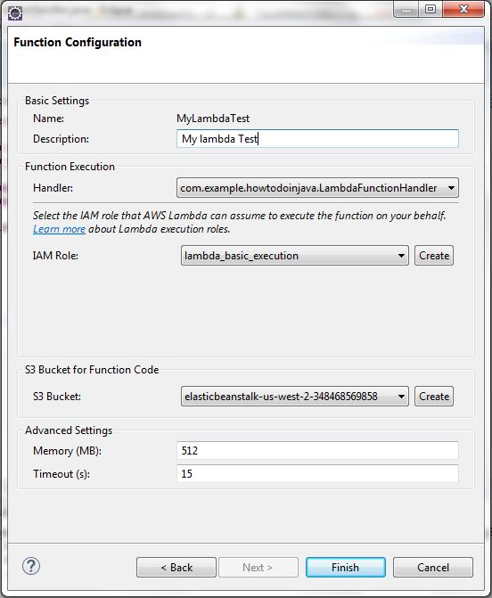

## AWS Lambda Function Example
- Today along with Microservices, another concept is very popular that is Serverless architecture. 
    - Serverless refers to the cloud deployment model with elasticity 
        - where you deploy your code/services to 3rd party cloud providers (e.g. AWS) 
        - instead of managing servers and platform manually. 
        - Cloud provider provides all infrastructure and platform support 
        - where you can just host your code with your choice of programming language 
        - and rest of the things are taken care by the cloud infrastructure.
- Typically, in serverless architectures, 
    - the cost of hosting is also based on the time of execution of that function only i.e. compute time, 
    - even when your usage scales from a few requests per day to thousands per second. 
    - This is really a great flexibility for the organizations in terms of 
        - cost, performance and easy maintenance point of view. 
    - That is why this approach of developing Microservices (rather Nanoservices or FaaS).
- Serverless architectures refer to applications that significantly depend on 
    - third-party services (knows as Backend as a Service or BaaS) or 
    - on custom code that’s run in ephemeral containers (Function as a Service or FaaS), 
    - the best known vendor host of which currently is AWS Lambda. 
    – (By Martin Flower)
- AWS is market leader in cloud area where they have provided one such platform called “AWS Lambda“. 
    - In Lambda, we can host functions or code in many diversified language support like Java, Node, .Net, Python etc.
- Today we will discuss how to develop one simple function with Java in eclipse 
    - and then we will deploy the function in AWS Lambda platform.
    
### Prerequisite
- AWS account 
    – Before starting this exercise, 
    - we need to register ourselves with the AWS free tier account. 
    - AWS provides this type of access for 1 year to do the practice on different services. 
    - It is very straight forward and to do that you need to follow 
        - this link https://aws.amazon.com/ 
        - and need to click on “Create an AWS Account” button in top right corner of the home page itself.
- Give required registration details. 
    - It will ask for some credit card, 
    - feel free to provide your own, 
    - AWS will not bill unless you have tried the services that does not falls under free tier.
- AWS toolkit installed in Eclipse 
    – Need to follow official AWS documentation on this topic for proceeding with installation and configuration. 
    - This is just like another eclipse plug in installation. 
    - Once installed we need to configure the AWS credentials with your own Key Pair downloaded from AWS Console. 
    - The official documentation has clearly mentioned those steps, that is the reason we are skipping those installation part.
    
### Develop Lambda Function
- So our environment is ready, we will now develop the Lambda Function will then deploy in AWS and test from AWS console.

#### Create AWS Lambda Java Project
- We need to first create one eclipse project to start writing the Lambda function. 
- Here we will create AWS lambda project with the AWS toolkit. 
- To create the project just right click on Project explorer and 
- create a new Project and select AWS Lambda Java Project as type of project. 
- Enter required details and Lambda project will be created. 
- Here are couple of eclipse screen shot while I created this example project used in this article.        
- 
- 
- 
-     
- 

#### Add Lambda function Code
- We have now created the lambda project and 
    - all the required runtime dependencies has been provided by AWS toolkit and 
    - we are ready to go with adding logic to our lambada function.
- Open the LambdaFunctionHandler class created while creating the project and add your logic there. 
    - Here in our case the function is taking MyLambdaRequest as request and MyLambdaResponse as response. 
        - Lambda will convert those to JSON while executing and 
        - the Object to JSON serialization will take automatically, 
        - in the AWS side.
- In this case our logic is very simple, 
    - we are just printing the request and 
    - populating some greeting message in the response along with couple of other values. 
- The final code will look like –

~~~java
import java.util.Date;
import java.util.UUID;
import com.amazonaws.services.lambda.runtime.Context;
import com.amazonaws.services.lambda.runtime.RequestHandler;
 
public class LambdaFunctionHandler implements RequestHandler<MyLambdaRequest, MyLambdaResponse> {
 
    @Override
    public MyLambdaResponse handleRequest(MyLambdaRequest input, Context context) {
        context.getLogger().log("Input: " + input);
        MyLambdaResponse lambdaResponse = new MyLambdaResponse();
        try {
            lambdaResponse.setResponseMessage("Hello " + input.getName() + " Response Time : " + new Date());
            lambdaResponse.setTransactionID(UUID.randomUUID().toString());
        } catch (Exception e) {
            e.printStackTrace();
            lambdaResponse.setResponseMessage(e.getMessage());
        }
        context.getLogger().log("Response : " + lambdaResponse);
        return lambdaResponse;
    }
}

public class MyLambdaRequest 
{
    String name;
 
    public String getName() {
        return name;
    }
 
    public void setName(String name) {
        this.name = name;
    }
 
    @Override
    public String toString() {
        return "MyLambdaRequest [name=" + name + "]";
    }
}

public class MyLambdaResponse {
    String responseMessage;
    String transactionID;
 
    public String getResponseMessage() {
        return responseMessage;
    }
 
    public void setResponseMessage(String responseMessage) {
        this.responseMessage = responseMessage;
    }
 
    public String getTransactionID() {
        return transactionID;
    }
 
    public void setTransactionID(String transactionID) {
        this.transactionID = transactionID;
    }
 
    @Override
    public String toString() {
        return "MyLambdaResponse [responseMessage=" + responseMessage + "
                , transactionID=" + transactionID + "]";
    }
}
~~~

### Deploy Function to AWS Lambda
- So we have developed our lambda function. It is very simple for the demonstration purpose but we can add any complex business logic here. We can add code to interact to other AWS services like RDS, SNS, S3, SQS etc.
- Now we will deploy this function through AWS toolkit. Deployment steps are –
    - Right click on the project
    - click on Amazon Web Services menu and 
        - choose Upload Function to AWS Lambda option.
    - Choose required details like 
        - AWS region where it will be deployed, 
        - lambda function name, 
        - required memory etc. and 
        - click on Finish.
- After this, the Lambda function will be uploaded and deployed.
- Here are the screen shots that I have captured while uploading this example project.
- 
- 
- 
- 
- That’s all in the eclipse side, we will now login to AWS console and configure few things and test uploaded function from AWS console itself.

### Test Lambda Function From AWS Console
- Login into the AWS console with your credentials and 
    - change the region to what you selected while uploading the project from eclipse. 
        - In my case it is US-WEST(Oregon) and 
    - then go to Lambda service home page by clicking on the Lambda link from the services menu. 
        - Here is the the Services menu for going to Lambda home page.
-        
- Here is the Lambda Landing screen where we have all the Lambda functions that are already available for this AWS region. We can filter with the Lambda function name to locate the particular lambda function we want to loo into.
-        
- Now click on the lambda name and we will go into the details page, there we need to configure the test data for testing the function and after that we will click on the Test button on this page to invoke the function and see the result in the screen itself.
-        
- Now we will configure test data by clicking on the menu Actions --> configure test event. There we need to select template as Hello World and need to give corresponding JSON request which can be marshalled to the actual request type (in our case MyLambdaRequest). This screen will look like
-    
- Now once the test data has been configured we can click on the Test button and see the response along with logs in the same page as below.    
-        
