## Apache Kafka on AWS
- Demonstrates how to set up Apache Kafka on EC2, 
    - use Spark Streaming on EMR to process data coming in to Apache Kafka topics, and 
    - query streaming data using Spark SQL on EMR.

### Apache Kafka and Amazon EMR in VPC public subnets
- The following architecture diagram represents an EMR and Kafka cluster in a VPC public subnet and 
    - accesses them through a bastion host to control access and security.   
- - 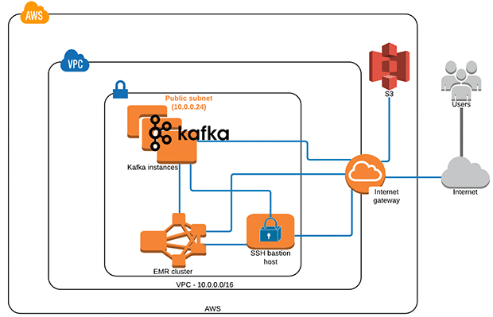    

### Apache Kafka and Amazon EMR in VPC private subnets
- The following architecture diagram represents an EMR cluster in a VPC private subnet with an S3 endpoint and NAT instance; 
    - Kafka can also be installed in VPC private subnets. 
    - Private subnets allow you to limit access to deployed components, 
    - and to control security and routing of the system. 
    - You access EMR and Kafka clusters through a bastion host.  
- 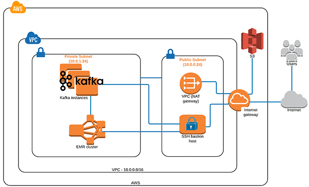 

### Stream processing walkthrough
- The entire pattern can be implemented in a few simple steps:
    - Set up Kafka on AWS.
    - Spin up an EMR 5.0 cluster with Hadoop, Hive, and Spark.
    - Create a Kafka topic.
    - Run the Spark Streaming app to process clickstream events.
    - Use the Kafka producer app to publish clickstream events into Kafka topic.
    - Explore clickstream events data with SparkSQL.
    
### Step 1: Set up Kafka on AWS
- An AWS CloudFormation template can be used to deploy an Apache Kafka cluster:
    - CloudFormation template for public subnets
    - CloudFormation template for private subnets
- This post explains how to deploy Apache Kafka on AWS. By default, the template sets up one Kafka ZooKeeper instance and one broker instance.
    - In the CloudFormation console, choose Create Stack.
    - Choose Upload a template to Amazon S3 template URL.
    - Choose Next.
    - Name and enter the following parameters:
    - 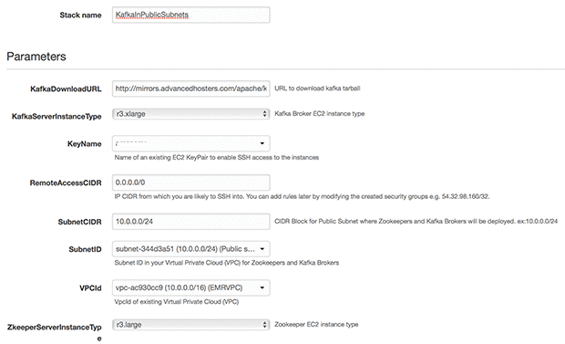 
    - Optionally, specify a tag for the instance. Choose Next.
    - Review choices, check the IAM acknowledgement, and then choose Create.
    - 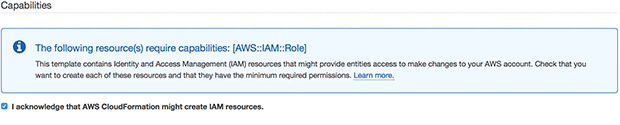 
- The stack takes several minutes to complete as it creates the EC2 instance and provisions Apache Kafka and its prerequisites.
- Return to the CloudFormation console. When the CloudFormation stack status returns CREATE_COMPLETE, your EC2 instance is ready. On the Output tab, note the DNS names for Kafka ZooKeeper and broker.
- 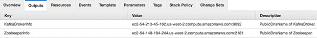     

### Step 2: Spin up an EMR 5.0 cluster with Hadoop, Hive, and Spark
- This step allows the creation of the EMR cluster. You may use the following sample command to create an EMR cluster with AWS CLI tools or you can create the cluster on the console.
- If you decide to create the cluster using the CLI, remember to replace myKeyName, myLogBucket, myRegion, and mySubnetId with your EC2 key pair name, logging bucket, region, and public/private subnets.
~~~shell script
aws emr create-cluster \
     --name Blogreplay \
     --release-label emr-5.0.0 \
     --instance-groups InstanceGroupType=MASTER,InstanceCount=1,InstanceType=m4.xlarge InstanceGroupType=CORE,InstanceCount=2,InstanceType=m4.xlarge \
     --service-role EMR_DefaultRole \
     --ec2-attributes InstanceProfile=EMR_EC2_DefaultRole, SubnetId=mySubnetId,KeyName=myKeyName \
     --log-uri s3://myLogBucket \
     --enable-debugging \
     --no-auto-terminate \
     --visible-to-all-users \
     --applications Name=Hadoop Name=Hive Name=Spark \
     --region myRegion 
~~~          
### Step 3: Create a Kafka topic 
- Kafka maintains feeds of messages in topics. A topic is a category or feed name to which messages are published. To create a Kafka topic, use the following instructions.
- Log in to the ZooKeeper EC2 instance:
~~~shell script
ssh -i "yourKey.pem" ec2-user@<<zookeeperinstanceDNS>>
~~~
- Execute the following command to create a Kafka topic called “blog-replay”:
~~~shell script
cd /app/kafka/kafka_2.9.2-0.8.2.1/bin/
./kafka-topics.sh --zookeeper <<zookeeperinstanceDNS>>:2181 --create --topic blog-replay --partitions 2 --replication-factor 1
~~~
- Note: Change the ZooKeeper instance DNS address based on your environment.
- 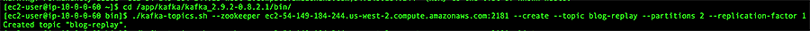
- Also run the following command to make sure that the Kafka topic (“blog-replay”) has been created:
~~~shell script
./kafka-topics.sh --zookeeper <<zookeeperinstanceDNS>>:2181 --list
~~~   
- 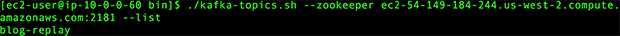
### Step 4: Run the Spark Streaming app to process clickstream events
- The Spark Streaming app is able to consume clickstream events as soon as the Kafka producer starts publishing events (as described in Step 5) into the Kafka topic. For this post, I used the Direct Approach (No Receivers) method of Spark Streaming to receive data from Kafka.
- After the Kafka producer starts publishing, the Spark Streaming app processes clickstream events, extracts metadata, and stores it in Apache Hive for interactive analysis. Below code explains.
~~~java
package com.awsproserv.kafkaandsparkstreaming
import kafka.serializer.StringDecoder
import org.apache.spark.streaming._
import org.apache.spark.streaming.kafka._
import org.apache.spark.SparkConf
import org.apache.spark.SparkContext

import org.apache.spark.rdd.RDD
import org.apache.spark.storage.StorageLevel
import org.apache.spark.streaming.{ Seconds, StreamingContext, Time }

import org.apache.spark.sql.SparkSession
import org.apache.spark.sql._

object ClickstreamSparkstreaming {

  def main(args: Array[String]) {

    if (args.length < 2) {
      System.err.println(s"""
        |Usage: ClickstreamSparkstreaming <brokers> <topics> 
        |  <brokers> is a list of one or more Kafka brokers
        |  <brokers> is a list of one or more Kafka topics to consume from
        |
        """.stripMargin)
      System.exit(1)
    }

    val Array(brokers, topics) = args
    val sparkConf = new SparkConf().setAppName("DirectKafkaClickstreams")
    // Create context with 10-second batch intervals
    val ssc = new StreamingContext(sparkConf, Seconds(10))

    // Create direct Kafka stream with brokers and topics
    val topicsSet = topics.split(",").toSet
    
    val kafkaParams = Map[String, String]("metadata.broker.list" -> brokers)
    
    val messages = KafkaUtils.createDirectStream[String, String, StringDecoder, StringDecoder](
      ssc, kafkaParams, topicsSet)

    val lines = messages.map(_._2)
    
    val warehouseLocation = "file:${system:user.dir}/spark-warehouse"
    val spark = SparkSession
      .builder
      .config(sparkConf)
      .config("spark.sql.warehouse.dir", warehouseLocation)
      .enableHiveSupport()
      .getOrCreate()
   
    // Drop the table if it already exists 
    spark.sql("DROP TABLE IF EXISTS csmessages_hive_table")
    // Create the table to store your streams 
    spark.sql("CREATE TABLE csmessages_hive_table ( recordtime string, eventid string, url string, ip string ) STORED AS TEXTFILE")
// Convert RDDs of the lines DStream to DataFrame and run a SQL query
    lines.foreachRDD { (rdd: RDD[String], time: Time) =>
      
    import spark.implicits._
      // Convert RDD[String] to RDD[case class] to DataFrame
 
     val messagesDataFrame = rdd.map(_.split(",")).map(w => Record(w(0), w(1), w(2), w(3))).toDF()
      
      // Creates a temporary view using the DataFrame
      messagesDataFrame.createOrReplaceTempView("csmessages")
      
      //Insert continuous streams into Hive table
      spark.sql("INSERT INTO TABLE csmessages_hive_table SELECT * FROM csmessages")

      // Select the parsed messages from the table using SQL and print it (since it runs on drive display few records)
      val messagesqueryDataFrame =
      spark.sql("SELECT * FROM csmessages")
      println(s"========= $time =========")
      messagesqueryDataFrame.show()
    }
  // Start the computation
    ssc.start()
    ssc.awaitTermination()

  }
}
/** Case class for converting RDD to DataFrame */
case class Record(recordtime: String,eventid: String,url: String,ip: String)
~~~
- To run the Spark streaming application, use the following instructions.
- Get the source code from the aws-blog-sparkstreaming-from-kafka GitHub repo. Run “mvn clean install” to generate the JAR file and copy the kafkaandsparkstreaming-0.0.1-SNAPSHOT-jar-with-dependencies.jar file from your /target folder to an S3 bucket.
~~~shell script
aws s3 cp kafkaandsparkstreaming-0.0.1-SNAPSHOT-jar-with-dependencies.jar s3://<<YourS3Bucket>>/
~~~
- 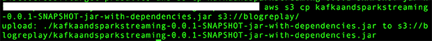
- Use the EMR add-steps command to run the Spark Streaming app and process clickstream events from the Kafka topic.
~~~shell script
aws emr add-steps --cluster-id <YourClusterID> --steps Type=spark,Name=SparkstreamingfromKafka,Args=[--deploy-mode,cluster,--master,yarn,--conf,spark.yarn.submit.waitAppCompletion=true,--num-executors,3,--executor-cores,3,--executor-memory,3g,--class,com.awsproserv.kafkaandsparkstreaming.ClickstreamSparkstreaming,s3://<YourS3Bucket>/kafkaandsparkstreaming-0.0.1-SNAPSHOT-jar-with-dependencies.jar,<YourKafkaBrokerDNS>:9092,blog-replay],ActionOnFailure=CONTINUE
~~~
- Note: Modify the above command to reflect the ClusterId (for example, j-17DQ5BN6HWKAC), S3 bucket, and KafkaBrokerDNS value.
- 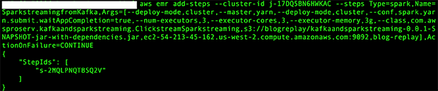
- 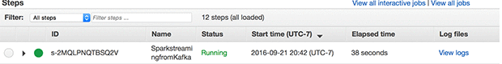

### Step 5: Use the Kafka producer app to publish clickstream events into the Kafka topic
- A Kafka producer application written in Scala ingests random clickstream data into the Kafka topic “blog-replay”.  To run the Kafka producer application, use the following instructions:
- Get the source code from the aws-blog-sparkstreaming-from-kafka GitHub repo. Run “mvn clean install” to generate the JAR file and copy the kafkaandsparkstreaming-0.0.1-SNAPSHOT-jar-with-dependencies.jar file from your /target folder to the Kafka broker instance.
~~~shell script
scp -i "yourKey.pem" kafkaandsparkstreaming-0.0.1-SNAPSHOT-jar-with-dependencies.jar ec2-user@<<KafkaBrokerDNS>>:
~~~
- Log in to the Kafka broker:
~~~shell script
ssh -i "yourKey.pem" ec2-user@<<KafkaBrokerDNS>>
~~~
- The below code explains how to produce random click stream events to Kafka topic
~~~java
package com.awsproserv.kafkaandsparkstreaming

import kafka.producer.ProducerConfig
import java.util.Properties
import kafka.producer.Producer
import scala.util.Random
import kafka.producer.Producer
import kafka.producer.Producer
import kafka.producer.Producer
import kafka.producer.KeyedMessage
import java.util.Date

object ClickstreamKafkaProducer extends App{
  
  val events = args(0).toInt
  val topic = args(1)
  val brokers = args(2)
  
  val rnd = new Random()
  val props = new Properties()
  props.put("metadata.broker.list", brokers)
  props.put("serializer.class", "kafka.serializer.StringEncoder")
  props.put("producer.type", "async")
 
  val config = new ProducerConfig(props)
  val producer = new Producer[String, String](config)
  val t = System.currentTimeMillis()
  for (nEvents <- Range(0, events)) {
    val runtime = new Date().getTime();
    val ip = "192.168.2." + rnd.nextInt(255);
    val url = "www.amazon" + rnd.nextInt(255) + ".com";
    val msg = runtime + "," + nEvents + "," + url + "," + ip;
    val data = new KeyedMessage[String, String](topic, ip, msg);
    producer.send(data);
  }

  System.out.println("sent per second: " + events * 1000 / (System.currentTimeMillis() - t));
  producer.close();
  
}
~~~
- Execute the following command to publish clickstream events to the Kafka topic:
~~~shell script
java -cp kafkaandsparkstreaming-0.0.1-SNAPSHOT-jar-with-dependencies.jar com.awsproserv.kafkaandsparkstreaming.ClickstreamKafkaProducer 25 blog-replay localhost:9092
~~~
- The parameters used are:
    - 25 – Number of events to generate
    - blog-replay – Topic name
    - localhost – Kafka broker address
    - 9092 – Default Kafka port number
- Observe the output, as shown below:
- 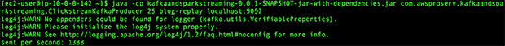    
- Data has been published to the Kafka topic in CSV format as shown below:
    - recordtime,eventid,url,ip

### Step 6: Explore clickstream event data with SparkSQL
- In the previous steps, clickstream events were generated using the Kafka producer and published to the Kafka topic. These events have been processed with Spark Streaming.
- Next, log in to the EMR master node, launch a SparkSQL session, run a few SQL commands to explore the processed events that you have published.
    - ssh -i ~/yourKey.pem hadoop@<<MasterNodeDNS>>
- Type spark-sql to launch the spark-sql CLI session:
~~~jql
select * from csmessages_hive_table limit 10;
~~~    
- 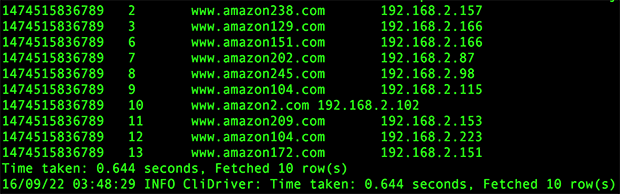    

### Conclusion
- Running broker processes does not guarantee that the cluster is in a good state. 
    - The team experienced problems with undetected Kafka errors even though the Kafka broker process was running. 
    - Monitor the ZooKeeper path (/broker/ids) to make sure that brokers are registered under its path.
- Be aware that a different machine image could affect the functionality or performance of Kafka.
- Make sure to use separate instances for Kafka brokers and zookeepers. 
    - This makes debugging problems easier.
- Having more than one Kafka cluster in different Availability Zones can help zone failover issues 
    - and also help in upgrading, 
    - as compared to having one cluster that requires one-on-one upgrades.