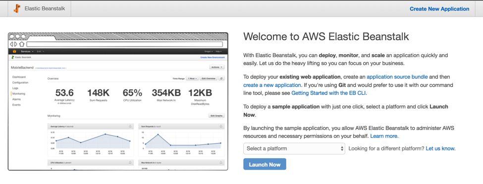
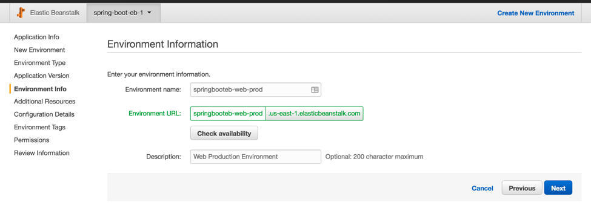
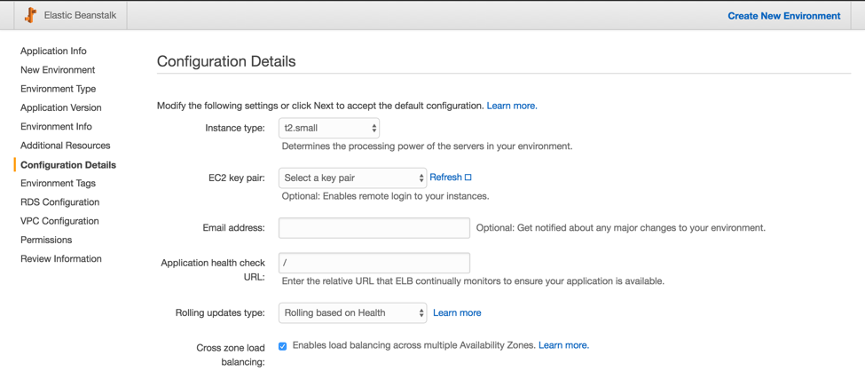
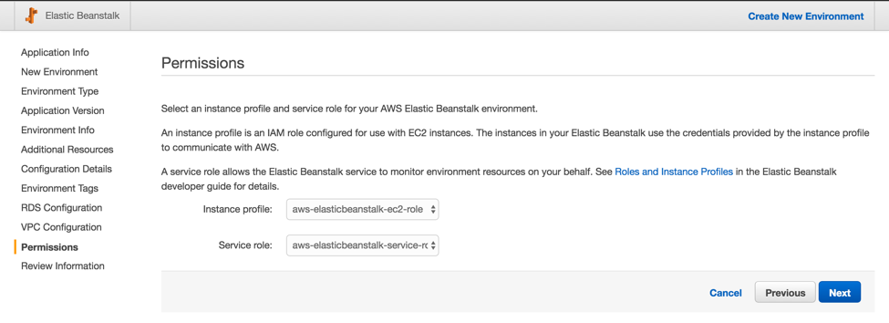
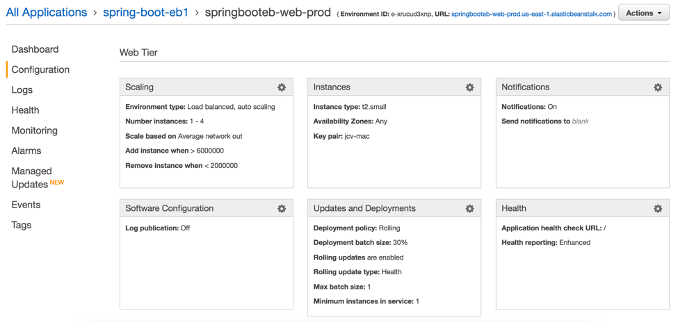
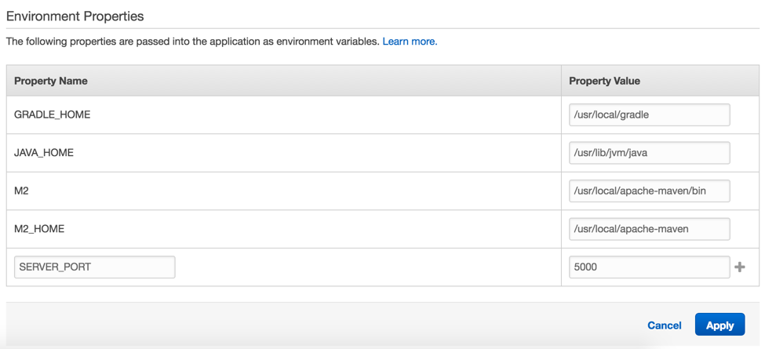
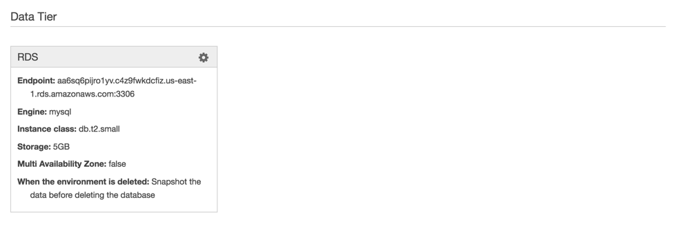
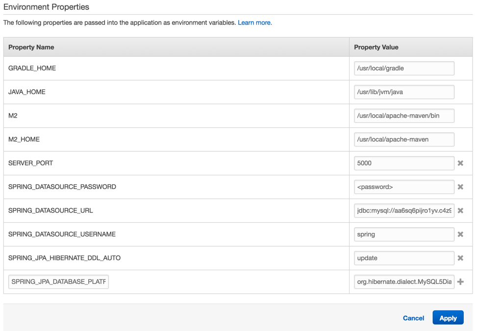

## Deploying a Spring Boot Application on AWS
- Spring Boot is often described as a quick and easy way of building production-grade Spring Framework-based applications. To accomplish this, Spring Boot comes prepackaged with auto configuration modules for most libraries typically used with the Spring Framework. This is often referred to as “convention over configuration.”
- AWS Elastic Beanstalk offers a similar approach to application deployment. It provides convention over configuration while still giving you the ability to dig under the hood to make adjustments, as needed. This makes Elastic Beanstalk a perfect match for Spring Boot.
- The sample application used in this blog post is the gs-accessing-data-rest sample project provided as part of the Accessing JPA Data with REST topic in the Spring Getting Started Guide. The repository is located in GitHub at https://github.com/spring-guides/gs-accessing-data-rest.

### Anatomy of the Sample Application
- The sample application is a very simple Spring Boot-based application that leverages the spring-data and spring-data-rest projects. The default configuration uses the H2 in-memory database. For this post, I will modify the build steps to include the mysql-connector library, which is required for persisting data to MySQL.
- The application exposes a REST-based API with features such as pagination, JSON Hypertext Application Language (HAL), Application-Level Profile Semantics (ALPS), and Hypermedia as the Engine of Application State (HATEOAS). It has defined one model named “Person” with the following properties: id, firstName, and lastName. The defined repository interface exposes a function to find a “Person” by last name. This function is called “findByLastName.”

### A Few Words About Elastic Beanstalk
- Elastic Beanstalk is a managed service designed for deploying and scaling web applications and services. It supports languages such as Java, .NET, PHP, Node.js, Python, Ruby, and Go. It also supports a variety of web/application servers such as Apache, Nginx, Passenger, Tomcat, and IIS. Elastic Beanstalk also supports deployments of web application and services using Docker.
- In this blog post, I’ll leverage Elastic Beanstalk’s support for Java 8. I will not be using Java with Tomcat because Spring Boot bundles an embedded Tomcat server suitable for production workloads.

### Building and Bundling the Sample Application
- The first step is to clone the repository from GitHub, add “mysql-connector” to the build steps, compile it, and generate a “fat” JAR containing all of the required library dependencies. To accomplish this, I will use Git (https://git-scm.com/downloads) and Gradle (downloaded automatically through a wrapper script).
~~~shell script
git clone https://github.com/spring-guides/gs-accessing-data-rest.git
cd gs-accessing-data-rest/complete
~~~
- In the build.gradle file, replace “compile(“com.h2database:h2″)” with “compile(“mysql:mysql-connector-java:6.0.3″)”. This step will replace the use of H2 with the mysql-connector required for persisting data to MySQL using Amazon RDS.
- Build the project using the Gradle wrapper.
~~~shell script
./gradlew bootRepackage
~~~
- After Gradle finishes building the application, the JAR will be located in build/libs/gs-accessing-data-rest-0.1.0.jar.

### Setting Up an Elastic Beanstalk Application
- Sign in to the AWS Management Console, and then open the Elastic Beanstalk console. If this is your first time accessing this service, you will see a Welcome to AWS Elastic Beanstalk page. Otherwise, you’ll land on the Elastic Beanstalk dashboard, which lists all of your applications.
-    
- Choose Create New Application. This will open a wizard that will create your application and launch an appropriate environment.
- An application is the top-level container in Elastic Beanstalk that contains one or more application environments (for example prod, qa, and dev or prod-web, prod-worker, qa-web, qa-worker).
- 
- The next step is to choose the environment tier. Elastic Beanstalk supports two environment tiers: Web server and Worker. For this blog post, set up a Web Server Environment tier.
-       
- When you choose Create web server, the wizard will display additional steps for setting up your new environment. Don’t be overwhelmed!
- Now choose an environment configuration and environment type. For Predefined configuration, choose Java. For Environment type, choose Load Balancing, auto scaling.
- 
- Specify the source for the application. Choose Upload your own, and then choose the JAR file built in a previous step. Leave the deployment preferences at their defaults.
- 
- Next, on the Environment Information page, configure the environment name and URL and provide an optional description. You can use any name for the environment, but I recommend something descriptive (for example, springbooteb-web-prod). You can use the same prefix as the environment name for the URL, but the URL must be globally unique. When you specify a URL, choose Check availability before you continue to the next step.
- 
- On the Additional Resources page, you’ll specify if you want to create an RDS instance with the web application environment. Select Create an RDS DB Instance with this environment and Create this environment inside a VPC.
- 
- For Instance type, choose t2.small. If you have an Amazon EC2 key pair and want to be able to remotely connect to the instance, choose your key pair now; otherwise, leave this field blank. Also, set the Application health check URL to “/”. Leave all of the other settings at their defaults.
- 
- On the Environment Tags page, you can specify up to seven environment tags. Although this step is optional, specifying tags allows you to document resources in your environment. For example, teams often use tags to specify things like environment or application for tracking purposes.
- 
- On the RDS Configuration page, configure a MySQL database with an Instance class of db.t2.small. Specify a Username and Password for database access. Choose something easy to remember because you’ll need them in a later step. Also, configure the Availability to Multiple availability zones. Leave all of the other settings at their defaults.
- 
- The next step in the wizard is used to configure which VPC and subnets to use for environment resources. Specifying a VPC will give you full control over the network where the application will be deployed, which, in turn, gives you additional mechanisms for hardening your security posture.
- For this deployment, specify the default VPC that comes with all recently created AWS accounts. Select the subnets Elastic Beanstalk will use to launch the Elastic Load Balancing load balancers and EC2 instances. Select at least two Availability Zones (AZ) for each service category (ELB and EC2), in order to achieve high-availability.
- Select Associate Public IP Address so that compute instances will be created in the public subnets of the selected VPC and will be assigned a public IP address. The default VPC created with most accounts contains only public subnets. Also, for the VPC security group choose the default security group already created for your default VPC.
- 
- On the Permissions page, configure the instance profile and service role that the Elastic Beanstalk service will use to deploy all of the resources required to create the environment. If you have launched an environment with this wizard before, then the instance profile and service role have already been created and will be selected automatically; it not, the wizard will create them for you.
- By default, AWS services don’t have permissions to access other services. The instance profile and service role give Elastic Beanstalk the permissions it needs to create, modify, and delete resources in other AWS services, such as EC2.
- 
- The final step in the wizard allows you to review all of the settings. Review the configuration and launch the environment! As your application is being launched, you’ll see something similar to this on the environment dashboard.
- 
- During the launch process, Elastic Beanstalk coordinates the creation and deployment of all AWS resources required to support the environment. This includes, but is not limited to, launching two EC2 instance, creating a Multi-AZ MySQL database using RDS, creating a load balancer, and creating a security group.
- Once the environment has been created and the resources have been deployed, you’ll notice that the Health will be reported as Severe. This is because the Spring application still needs some configuration.
- 
- Configuring Spring Boot Through Environment Variables
- By default, Spring Boot applications will listen on port 8080. Elastic Beanstalk assumes that the application will listen on port 5000. There are two ways to fix this discrepancy: change the port Elastic Beanstalk is configured to use, or change the port the Spring Boot application listens on. For this post, we will change the port the Spring Boot application listens on.
- The easiest way to do this is to specify the SERVER_PORT environment variable in the Elastic Beanstalk environment and set the value to 5000. (The configuration property name is server.port, but Spring Boot allows you to specify a more environment variable-friendly name).
- On the Configuration page in your environment, under Software Configuration, click the settings icon.
- 
- On the Software Configuration page, you’ll see that there are already some environment variables set. They are set automatically by Elastic Beanstalk when it is configured to use the Java platform.
- To change the port that Spring Boot listens on, add a new environment variable, SERVER_PORT, with the value 5000.
- 
- In addition to configuring the port the application listens on, you also need to specify environment variables to configure the database that the Spring Boot application will be using.
- Before the Spring Boot application can be configured to use the RDS database, you’ll need to get the database endpoint URI. On the Environment Configuration page, under the Data Tier section, you’ll find the endpoint under RDS.
- 
- Spring Boot bundles a series of AutoConfiguration classes that configure Spring resources automatically based on other classes available in the class path. Many of these auto configuration classes accept customizations through configuration, including environment variables. To configure the Spring Boot application to use the newly created MySQL database, specify the following environment variables:
~~~text
SPRING_DATASOURCE_URL=jdbc:mysql://<url>/ebdb
SPRING_DATASOURCE_USERNAME=<username>
SPRING_DATASOURCE_PASSWORD=<password>
SPRING_JPA_HIBERNATE_DDL_AUTO=update
SPRING_JPA_DATABASE_PLATFORM=org.hibernate.dialect.MySQL5Dialect
~~~
- 
- As soon as you click Apply, the configuration change will be propagated to the application servers. The application will be restarted. When it restarts, it will pick up the new configuration through the environment variables. In about a minute, you’ll see a healthy application on the dashboard!
- 
- Testing Spring Boot in the Cloud
- Now test the deployed REST API endpoint!
- Use the URL you configured on the environment to access the service. For this example, the specified URL is http://springbooteb-web-prod.us-east-1.elasticbeanstalk.com/.
- For our first test, we’ll do an HTTP GET on the root of the URL:
~~~shell script
curl -X GET -i http://springbooteb-web-prod.us-east-1.elasticbeanstalk.com/

HTTP/1.1 200 OK
Date: Fri, 15 Jul 2016 20:19:13 GMT
Server: nginx/1.8.1
Content-Length: 282
Content-Type: application/hal+json;charset=UTF-8
Connection: keep-alive

{
  "_links" : {
    "people" : {
      "href" : "http://springbooteb-web-prod.us-east-1.elasticbeanstalk.com/people{?page,size,sort}",
      "templated" : true
    },
    "profile" : {
      "href" : "http://springbooteb-web-prod.us-east-1.elasticbeanstalk.com/profile"
    }
  }
}
~~~
- The service responded with a JSON HAL document. There’s a “people” repository you can access. Next, create a person!
~~~shell script
curl -X POST -H "Content-Type: application/json" -d '{ "firstName": "John", "lastName": "Doe" }' http://springbooteb-web-prod.us-east-1.elasticbeanstalk.com/people

{
  "firstName" : "John",
  "lastName" : "Doe",
  "_links" : {
    "self" : {
      "href" : "http://springbooteb-web-prod.us-east-1.elasticbeanstalk.com/people/1"
    },
    "person" : {
      "href" : "http://springbooteb-web-prod.us-east-1.elasticbeanstalk.com/people/1"
    }
  }
}
~~~
- You’ve successfully added a person. Now get a list of people.
~~~shell script
curl -X GET http://springbooteb-web-prod.us-east-1.elasticbeanstalk.com/people

{
  "_embedded" : {
    "people" : [ {
      "firstName" : "John",
      "lastName" : "Doe",
      "_links" : {
        "self" : {
          "href" : "http://springbooteb-web-prod.us-east-1.elasticbeanstalk.com/people/1"
        },
        "person" : {
          "href" : "http://springbooteb-web-prod.us-east-1.elasticbeanstalk.com/people/1"
        }
      }
    } ]
  },
  "_links" : {
    "self" : {
      "href" : "http://springbooteb-web-prod.us-east-1.elasticbeanstalk.com/people"
    },
    "profile" : {
      "href" : "http://springbooteb-web-prod.us-east-1.elasticbeanstalk.com/profile/people"
    },
    "search" : {
      "href" : "http://springbooteb-web-prod.us-east-1.elasticbeanstalk.com/people/search"
    }
  },
  "page" : {
    "size" : 20,
    "totalElements" : 1,
    "totalPages" : 1,
    "number" : 0
  }
}
~~~
- There’s the person you added! The response from the server is a HAL document with HATOAS and pagination.
### Conclusion
- In just a few clicks you’ve deployed a simple, production-ready Spring Boot application with a MySQL database on AWS using Elastic Beanstalk.
- As part of the launch and configuration of the environment, Elastic Beanstalk launched resources using other AWS services. These resources still remain under your control. They can be accessed through other AWS service consoles (for example, the EC2 console and the RDS console).
- This is not the only way to deploy and manage applications on AWS, but it’s a powerful and easy way to deploy product-grade applications and services. Most of the configuration options you set during the setup process can be modified. There are many more options for customizing the deployment. I hope you found this post helpful. Feel free to leave feedback in the comments.

### Reference
- https://aws.amazon.com/search/?searchQuery=deploying%20java#facet_type=blogs&limit=25&page=1&sortResults=modification_date%20desc